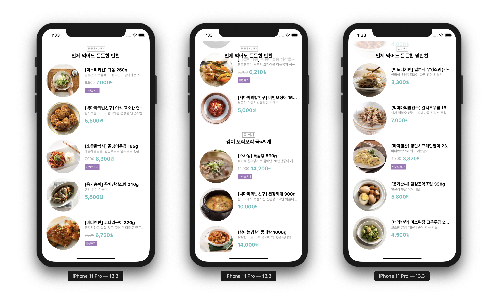

# Side Dish iOS

코드스쿼드 반찬 서비스 iOS 앱

## 단계별 구현 내용

### 메인페이지 반찬 보여주기

> [PR #18 [iOS] Todo List Board UI 구현][pr18]

* 스토리보드로 커스텀 테이블뷰 셀, 커스텀 헤더 뷰 구현
* 테이블 뷰에 표시할 모델을 갖고있는 뷰모델과, 테이블 뷰 셀에 표시할 모델을 갖고있는 뷰모델 구현
* 테이블 뷰 셀에 반찬 이미지, 뱃지 등 정보 표시
* 바뀐 테이블뷰 section만 업데이트하도록 개선

Related issues: [#8][issue8] and [#13][issue13]

**실행 결과**

[issue8]: https://github.com/codesquad-member-2020/sidedish-12/issues/8
[issue13]: https://github.com/codesquad-member-2020/sidedish-12/issues/13

